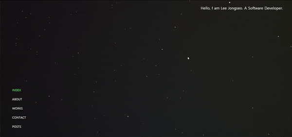

<!-- Logo (with link) -->

  

<!-- Title -->
<h1 align="center">
  My Gatsby Site
</h1>

<!-- Badges (with link) -->

<!-- 

  
  
  
  

 -->

<!-- Small description -->

A personal site made with the static site generator <a href="https://www.gatsbyjs.com/">Gatsby</a>

<!-- Screenshot or video (with link) -->

  

